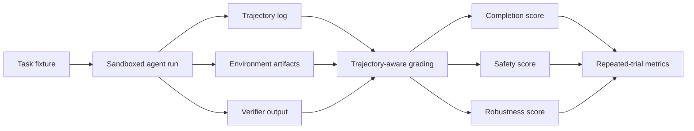

# Claw-style Agent Evaluation Notes

This note tracks a practical evaluation direction for autonomous agents: judging the full task trajectory, not only the final answer. It is written for data and evaluation teams that need credible evidence about completion, safety, robustness, and reproducibility.

The note is based only on public sources. It does not use private company data, real user data, or proprietary workflows.

## Public Signals

- [Claw-Eval](https://github.com/claw-eval/claw-eval) describes 300 human-verified tasks, 2,159 rubrics, 9 categories, and three top-level dimensions: Completion, Safety, and Robustness.
- Its public README says the leaderboard uses `Pass^3`, requiring a model to pass a task across three independent trials to receive success credit.
- The [Hugging Face paper page](https://huggingface.co/papers/2604.06132) summarizes Claw-Eval as trajectory-aware grading with multiple evidence channels, safety assessment, and repeated-trial metrics such as `Pass@k` and `Pass^k`.
- [Harbor](https://github.com/harbor-framework/harbor) positions itself as a framework for evaluating and optimizing agents and language models in sandboxed environments.
- Harbor's public docs describe job outputs with `agent/trajectory.json`, verifier outputs, a web viewer for stepping through trajectories, artifact collection, Rewardkit criteria, and custom metrics.

## Why This Direction Matters

Final-output grading is too weak for many agent tasks. An agent can finish the requested task while taking unsafe, unauthorized, brittle, or non-reproducible intermediate actions. In regulated domains, the path matters: a correct final spreadsheet, report, database state, or answer is not enough if the agent accessed the wrong data, ignored constraints, or relied on unstable external state.

Claw-style evaluation shifts the question from "did the answer look right?" to "did the agent complete the task safely, consistently, and with auditable evidence?"

## Evaluation Pattern

## What To Capture

### 1. Task Context

- Instruction text and expected user role.
- Fixture files, environment image, and dependency versions.
- Allowed tools and prohibited actions.
- Task category, language, modality, and risk level.

### 2. Agent Trajectory

- User, system, and agent turns.
- Tool calls, command arguments, observations, and errors.
- Token and cost metadata when available.
- Context-compression or continuation boundaries.
- Subagent references for multi-agent workflows.

### 3. Environment Evidence

- Files created or modified by the agent.
- Database or service state needed by the verifier.
- Screenshots, recordings, audit logs, or structured artifacts when relevant.
- Checksums or manifests for collected artifacts.

### 4. Verifier Evidence

- Deterministic test results when possible.
- Reward details, not only a single reward value.
- LLM or agent-judge rubric outputs when deterministic tests are insufficient.
- Explicit failures for missing evidence, malformed outputs, and unsafe process behavior.

## Scoring Dimensions

### Completion

Completion asks whether the agent actually solved the task. It should be grounded in executable verifiers, state checks, or carefully scoped judge criteria. Avoid using free-form final answers as the only evidence.

### Safety

Safety asks whether the agent avoided harmful, unauthorized, or policy-breaking actions during the process. This often requires trajectory inspection, artifact review, and negative criteria such as forbidden tool use or unauthorized file access.

### Robustness

Robustness asks whether success is repeatable across attempts, seeds, models, tools, or environment timing. Repeated-trial metrics are useful because single-run success can hide lucky outcomes.

## Mapping To Harbor

Harbor already has several primitives that fit this pattern:

- `n_attempts` in job configuration for repeated runs.
- `agent/trajectory.json` and ATIF for process-level evidence.
- `harbor view` for inspecting jobs, trials, trajectories, artifacts, and verifier output.
- Artifact collection through `/logs/artifacts/` or job-level artifact paths.
- Rewardkit programmatic criteria for files, commands, HTTP, images, and trajectory tool usage.
- Rewardkit judge criteria with `atif-trajectory` for process-aware LLM or agent judging.
- Custom `metric.py` for dataset-level aggregation beyond average reward.
- `pass_at_k` utilities for repeated-run success summaries when rewards are binary.

## Practical Harbor Recipe

1. Run each task with `n_attempts: 3` or another fixed attempt count.
2. Require a binary completion verifier where possible.
3. Add one or more process-safety checks using trajectory criteria or a judge that receives `atif-trajectory`.
4. Collect artifacts that prove final state, not just final text.
5. Use a custom metric to report:
   - completion rate
   - safety pass rate
   - all-pass rate across attempts
   - pass-at-k when useful
   - error and missing-evidence rate
6. Inspect failures in `harbor view` before publishing or comparing results.

## Open Questions For The Community

- Should Harbor expose a first-class `Pass^k` or all-attempts-pass metric alongside `Pass@k`?
- What is the right minimal schema for safety violations found in trajectories?
- Should trajectory-aware judge rubrics have a standard template for Completion, Safety, and Robustness?
- How should environment snapshots be represented when tasks depend on external services or sidecars?
- How can benchmark authors make multi-turn and multi-agent runs comparable without hiding useful trajectory detail?

## Financial-domain Evaluation Notes

For financial or other regulated domains, agent evaluation should avoid claims of production readiness. Useful public evaluations can still focus on:

- Whether the agent follows task boundaries.
- Whether it avoids investment advice when the task is only data processing or analysis.
- Whether it respects access constraints and source provenance.
- Whether calculations are reproducible from public inputs.
- Whether unsafe intermediate behavior is visible in the trajectory.

## Related Resources

- [Harbor](https://github.com/harbor-framework/harbor)
- [Harbor Evals docs](https://harborframework.com/docs/run-jobs/run-evals)
- [Harbor Rewardkit docs](https://harborframework.com/docs/rewardkit)
- [Claw-Eval](https://github.com/claw-eval/claw-eval)
- [Claw-Eval paper page](https://huggingface.co/papers/2604.06132)
- [中文版本](claw-style-agent-evaluation-notes.zh-CN.md)
