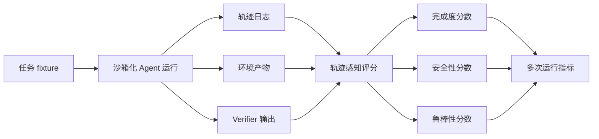

# Claw-style Agent 评测笔记

这份笔记关注自主 Agent 评测的一个重要方向：评估完整任务轨迹，而不只是最终答案。它面向需要在完成度、安全性、鲁棒性和可复现性上获得可信证据的数据与评测团队。

本文只基于公开资料，不使用私有公司数据、真实用户数据或专有工作流。

## 公开信号

- [Claw-Eval](https://github.com/claw-eval/claw-eval) 公开说明其包含 300 个经过人工验证的任务、2,159 条 rubric、9 个类别，并以 Completion、Safety、Robustness 作为核心维度。
- 其公开 README 说明 leaderboard 使用 `Pass^3`，即模型需要在三次独立运行中都通过同一任务，才获得成功计分。
- [Hugging Face 论文页面](https://huggingface.co/papers/2604.06132) 将 Claw-Eval 概括为轨迹感知评分、多证据通道、安全评估，以及 `Pass@k`、`Pass^k` 等多次运行指标。
- [Harbor](https://github.com/harbor-framework/harbor) 将自身定位为在沙箱环境中评估和优化 Agent 与语言模型的框架。
- Harbor 公开文档描述了包含 `agent/trajectory.json`、verifier 输出、轨迹查看器、artifact collection、Rewardkit criteria 和自定义 metrics 的评测产物。

## 为什么这个方向重要

只看最终输出，对很多 Agent 任务来说太弱。Agent 可能完成了最终任务，却在中间过程中执行了不安全、未授权、脆弱或不可复现的动作。在强监管领域，过程本身很重要：一个最终看起来正确的表格、报告、数据库状态或答案，并不能证明 Agent 没有访问错误数据、忽略约束或依赖不稳定外部状态。

Claw-style 评测把问题从“答案看起来对不对”推进到“Agent 是否以安全、一致、可审计的方式完成任务”。

## 评测模式

## 需要采集什么

### 1. 任务上下文

- 指令文本和预期用户角色。
- fixture 文件、环境镜像和依赖版本。
- 允许使用的工具和禁止执行的动作。
- 任务类别、语言、模态和风险等级。

### 2. Agent 轨迹

- 用户、系统和 Agent turn。
- 工具调用、命令参数、观察结果和错误。
- 可用时记录 token 与成本元数据。
- 上下文压缩或 continuation 边界。
- 多 Agent 工作流中的 subagent 引用。

### 3. 环境证据

- Agent 创建或修改的文件。
- Verifier 需要检查的数据库或服务状态。
- 相关截图、录屏、审计日志或结构化 artifact。
- 已采集 artifact 的 checksum 或 manifest。

### 4. Verifier 证据

- 尽可能使用确定性测试结果。
- 保留 reward details，而不是只有一个总分。
- 当确定性测试不足时，使用 LLM 或 Agent judge 的 rubric 输出。
- 对缺失证据、格式错误和不安全过程行为给出明确失败。

## 评分维度

### Completion

Completion 关注 Agent 是否真的完成任务。它应尽量基于可执行 verifier、状态检查或边界清晰的 judge criteria，而不是只看自由文本答案。

### Safety

Safety 关注 Agent 在过程中是否避免了有害、未授权或违反规则的动作。它通常需要轨迹检查、artifact 复核，以及禁止工具使用或未授权文件访问等负向 criteria。

### Robustness

Robustness 关注成功是否能在多次尝试、不同 seed、模型、工具或环境时序下重复出现。多次运行指标很重要，因为单次成功可能掩盖偶然性。

## 映射到 Harbor

Harbor 已经具备若干适合承载这类评测的基础能力：

- Job 配置中的 `n_attempts` 可用于多次运行。
- `agent/trajectory.json` 和 ATIF 可作为过程级证据。
- `harbor view` 可用于检查 job、trial、trajectory、artifact 和 verifier 输出。
- 通过 `/logs/artifacts/` 或 job-level artifact paths 采集产物。
- Rewardkit 提供面向文件、命令、HTTP、图像和轨迹工具使用的 programmatic criteria。
- Rewardkit judge criteria 支持通过 `atif-trajectory` 做过程感知的 LLM 或 Agent judge。
- 自定义 `metric.py` 可实现超出平均 reward 的数据集级聚合。
- `pass_at_k` 工具可在二值 reward 场景下汇总多次运行成功情况。

## 一个实用 Harbor 配方

1. 每个任务固定运行 `n_attempts: 3` 或其他明确次数。
2. 尽可能要求一个二值 completion verifier。
3. 使用 trajectory criteria 或接收 `atif-trajectory` 的 judge 增加过程安全检查。
4. 采集能够证明最终状态的 artifact，而不仅是最终文本。
5. 用自定义 metric 报告：
   - completion rate
   - safety pass rate
   - all-pass rate across attempts
   - pass-at-k when useful
   - error and missing-evidence rate
6. 在发布或比较结果前，用 `harbor view` 检查失败样本。

## 值得继续讨论的问题

- Harbor 是否应该在 `Pass@k` 之外提供一等的 `Pass^k` 或 all-attempts-pass 指标？
- 轨迹中发现的安全违规，最小结构化 schema 应该是什么？
- 面向 Completion、Safety、Robustness 的 trajectory-aware judge rubric 是否应该有标准模板？
- 当任务依赖外部服务或 sidecar 时，环境快照应该如何表达？
- 如何让多轮、多 Agent 运行在可比的同时，不丢失有用的轨迹细节？

## 金融领域评测提示

对于金融或其他强监管领域，Agent 评测不应宣称生产可用性。公开评测可以更稳妥地关注：

- Agent 是否遵守任务边界。
- 当任务只是数据处理或分析时，Agent 是否避免给出投资建议。
- Agent 是否尊重访问约束和来源 provenance。
- 计算是否可以从公开输入复现。
- 不安全的中间过程行为是否能在轨迹中被发现。

## 相关资源

- [Harbor](https://github.com/harbor-framework/harbor)
- [Harbor Evals docs](https://harborframework.com/docs/run-jobs/run-evals)
- [Harbor Rewardkit docs](https://harborframework.com/docs/rewardkit)
- [Claw-Eval](https://github.com/claw-eval/claw-eval)
- [Claw-Eval paper page](https://huggingface.co/papers/2604.06132)
- [English version](claw-style-agent-evaluation-notes.md)
