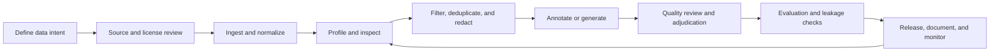

# LLM Training Data Operating Model

This note describes a practical operating model for teams that build, buy, annotate, filter, govern, or evaluate LLM data. It is intentionally conservative: the goal is to make data work inspectable, reproducible, and reviewable, especially in regulated or high-risk domains.

It does not assume access to private data, proprietary tooling, or internal production workflows.

## Why This Matters

Many LLM data efforts fail less because a single tool is missing and more because the work is not managed as an engineering system. Teams need a shared view of what is being collected, how it is transformed, which risks are accepted, and how quality evidence is recorded before training or evaluation results are trusted.

## Operating Loop

## 1. Data Intent

Before collecting or labeling data, define the job the dataset is expected to do.

- Target model behavior: pretraining, instruction tuning, reward modeling, retrieval evaluation, domain evaluation, safety evaluation, or regression testing.
- Intended users and contexts: language, domain, task type, and risk level.
- Out-of-scope uses: private data reconstruction, investment advice, policy bypass, or claims of production readiness without evidence.
- Decision owner: who can approve inclusion, exclusion, or release.

Good data intent makes later filtering and evaluation decisions less arbitrary.

## 2. Source and Rights Review

Every meaningful source should have a visible record of origin and use constraints.

- Source type: public repository, paper dataset, benchmark, web corpus, user-contributed data, synthetic data, or internal data.
- Access terms: license, terms of use, redistribution limits, consent assumptions, and takedown path.
- Collection boundary: time range, language, region, document type, crawler scope, or source list.
- Risk flags: personal data, financial records, copyrighted content, sensitive attributes, or benchmark contamination.

For public Awesome-list resources, prefer primary repositories, official dataset cards, papers, and standards over reposted summaries.

## 3. Ingestion and Normalization

Ingestion should preserve evidence while making data usable.

- Keep raw-source references or hashes when legal and practical.
- Normalize schemas, encodings, document identifiers, timestamps, and language metadata.
- Separate content fields from metadata fields.
- Track transformation versions so downstream changes can be explained.

Teams should avoid one-off scripts that silently overwrite source records.

## 4. Profiling and Inspection

Dataset quality work needs both aggregate signals and human inspection.

- Aggregate profile: language distribution, source distribution, length, token count, duplication, null fields, sensitive-data hits, and format errors.
- Slice profile: domain, task type, source family, time period, language, label, risk category, and difficulty.
- Human inspection: review examples from high-volume slices, rare slices, outliers, and newly added sources.
- Drift review: compare new versions against earlier releases.

Profiling is not a replacement for judgment, but it gives reviewers a map of where judgment is needed.

## 5. Filtering, Deduplication, and Redaction

Filtering decisions should be explicit and reversible when possible.

- Record filter names, versions, thresholds, and exclusion counts.
- Distinguish exact duplicates, near duplicates, boilerplate, and semantic overlap.
- Separate privacy redaction from quality filtering.
- Keep representative examples of excluded records for audit when allowed.
- Watch for over-filtering that removes rare but important domain examples.

In high-risk domains, exclusion criteria should be reviewed with legal, privacy, or governance partners before release.

## 6. Annotation or Generation

Human annotation and synthetic data generation both need quality controls.

- Annotation guidelines: task definition, edge cases, skip rules, tie rules, and examples.
- Calibration: pilot batches, reviewer discussion, agreement or disagreement review, and adjudication.
- Synthetic generation: generator model, prompts, sampling settings, filtering rules, and provenance fields.
- Preference data: prompt, candidate responses, preference label, tie/skip status, annotator or judge metadata, and rejected-response availability.

Generated data should be traceable as generated data. It should not be mixed into human data without provenance.

## 7. Quality Review and Adjudication

Quality review should focus on error patterns, not only average scores.

- Review disagreement clusters and ambiguous cases.
- Track reviewer drift over time.
- Separate guideline issues from annotator mistakes.
- Sample both accepted and rejected examples.
- Document known limitations instead of hiding them behind a single quality score.

For LLM data work, a short adjudication note is often more useful than a large dashboard nobody reads.

## 8. Evaluation and Leakage Checks

Evaluation data must be protected from training data decisions.

- Check exact and near duplicates between training, tuning, validation, and test sets.
- Separate splits by source, time, entity, document family, or task family when needed.
- Avoid using benchmark answers or rationales in synthetic-data prompts.
- Document when a dataset is suitable for development, validation, final reporting, or only exploratory analysis.
- In financial-domain evaluation, distinguish knowledge, reasoning, compliance, hallucination, retrieval grounding, and refusal behavior.

A benchmark is not a production-readiness certificate.

## 9. Release, Documentation, and Monitoring

A dataset release should include enough context for another team to understand and reproduce the decision.

- Dataset card, datasheet, or README.
- Version history and major changes.
- Known limitations and intended use.
- License and access notes.
- Quality checks performed and checks not performed.
- Issue tracker, maintainer contact, or deprecation path.

For internal or regulated settings, also record approval evidence and privacy/compliance review status.

## Lightweight Maturity Levels

| Level | Description | Typical evidence |
| --- | --- | --- |
| 0 | Ad hoc data work | One-off files, unclear source history, no review trail |
| 1 | Documented sources | Basic provenance, licenses, and schema notes |
| 2 | Repeatable processing | Versioned scripts, profiling reports, and dedup/filter logs |
| 3 | Reviewed quality | Annotation QA, adjudication notes, leakage checks, and risk review |
| 4 | Governed lifecycle | Release criteria, monitoring, deprecation, and cross-functional ownership |

Most teams do not need to jump to Level 4 immediately. Moving from Level 0 to Level 2 already prevents many expensive mistakes.

## Practical Questions for Maintainers

- Can a reviewer explain why this data exists?
- Can the team reproduce the same dataset version?
- Can the team find what changed between versions?
- Are quality failures visible by slice, not only as a global metric?
- Are privacy, rights, and compliance constraints documented before training?
- Is evaluation data protected from leakage and synthetic contamination?
- Is the dataset useful to real model or evaluation teams, not only impressive on paper?

## Related Guides

- [LLM Training Data Quality Rubric](data-quality-rubric.md)
- [Annotation Quality and Adjudication Guide](annotation-quality-guide.md)
- [Preference Data Quality Checklist](preference-data-quality-checklist.md)
- [Financial-domain LLM Evaluation Checklist](financial-domain-llm-evaluation-checklist.md)
- [中文版本](llm-training-data-operating-model.zh-CN.md)
